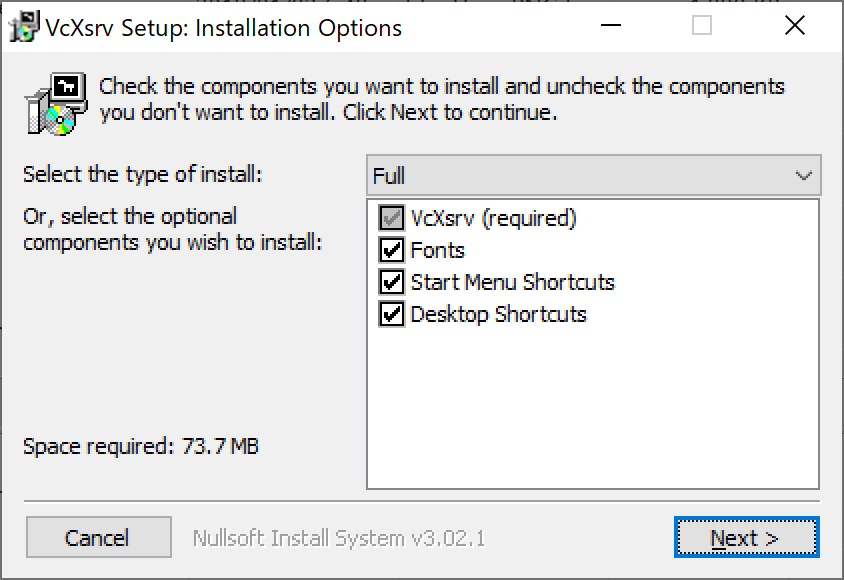

# 🔰X Window Systemをさわってみる

Windows Subsystem for LinuxとかAWSとかでUbuntuServerを立ち上げてピコピコさわったりすると。
ふとGUIを利用したい欲求が湧き出してきたのでGUIを利用するためにX Window Systemについて調べたことをまとめる。

## 🔰そもそもGUIを利用したいって？

CUI環境であるUbuntuServerでGUIを利用とは？　と思ったのですが。
どうやらX Window Systemを利用すればできるらしいので調べてみる。

## 🔰X Window Systemって？

X Window SystemはGUIを提供するフレームワークで1984年にマサチューセッツ工科大学で誕生しました。
現在のVersionは11で、このためx11とも呼ばれたりしている。

2018年現在、[X.Org Foundation](https://www.x.org/wiki/)という団体がX Window Systemの実装をオープンソースとして提供したりXの標準仕様を監督している。（X.orgが出している実装はX.org Server)

X.Org Server以外にも有償無償でOS問わず様々な実装が存在します。

## 🔰X Window Systemのドキュメント

X Window SystemはX.orgがリファレンス実装となっているので[xorg/ UserDocumentation](https://www.x.org/wiki/Documentation/)にあるドキュメント類をみると色々と理解が深まりそうな気がします。（古いバージョンになりますがオライリーのX Window Systemユーザガイドも参照できるようです）

あと[Linux Documentation Project](https://www.tldp.org/)の[XWindow-Overview-HOWTO](https://www.tldp.org/HOWTO/XWindow-Overview-HOWTO/index.html)も理解の助けになる気がします。

## 🔰X Window Systemのクライアントとサーバ

X Window Systemはクライアントとサーバーが存在するクライアントサーバーアーキテクチャになっており、クライアントとサーバはXプロトコルで通信を行い描画の制御を行っている。

クライアントとサーバに分離しているため実行と描画が同一端末である必要はなく、クライアントとサーバがネットワークごしに分離してても大丈夫。

クライアントとサーバはそれぞれ下記のような機能を受け持つ。

- XクライアントはX Window Systemで動作するアプリ。Xクライアントは画面描画を行う機能は持っておらずXサーバへ描画を依頼する機能を持つ。
- Xサーバは入力装置からの入力とディスプレイを管理している。またXサーバはユーザからの入力をXクライアントに渡し、Xクライアントからの入力により画面描画を行う。

XサーバとXクライアントがリモートで通信する場合はTCPでがやり取りを行う。
（Xサーバは6000番ポート+ディスプレイ番号で待受を行う。ディスプレイ番号0の場合は6000。ディスプレイ番号1の場合は6001。）

なお最近の実装だとXサーバとXクライアントが同一ホストで動作している場合はTCPではなくプロセス間通信をしているらしい？

## 🔰実際に試してみる

今回は下記の3パターンを実施してX WIndow Systemについて確認してみる。

- 【同一端末】WSL上のUbuntuServerにXorgをインストールしてXクライアント(xeyes)を実行。WindowsのXサーバ(MobaXterm)にGUIを表示する
- 【別端末】リモート(AWS)のUbuntuServerにXorgをインストール。WindowsのMobaXterm(SSHのx11-Forwarding)で接続してGUI表示する
- 【別端末】リモート(AWS)のUbuntuServerにXorgをインストールしてXクライアント(xeyes)を実行。リモート(AWS)のWindowsサーバのXサーバ(VcXrv)に表示する

### 🔰【同一端末】WSL上のUbuntuServerにXorgをインストールしてXクライアント(xeyes)を実行。WindowsのXサーバ(MobaXterm)に表示する

ここではそれぞれ環境を下記のように用意してGUIを利用してみる。

UbuntuServer上で利用するXクライアントはxeyes(マウスを追う目玉を表示するxアプリ)を利用。Windows上で利用するXサーバはMobaXtermを利用。

- UbuntuServer 18.0.4(WSL) + xorg
- Windows 10 + MobaXterm

#### 🔰Windows 10にMobaXtermをインストールして起動

Windows 10でXサーバを実装したソフトウェアは色々ありますが、今回はMobaXtermのフリー版を利用します。

下記の公式サイトからダウンロードしてインストール。

[https://mobaxterm.mobatek.net](https://mobaxterm.mobatek.net)

Xサーバを起動するにはインストールした後に、MobaXtermを起動するだけでOKです。
（MobaXtermは初期設定で下記画像のように起動時に勝手にXサーバを起動してくれる。Dispaly Offsetはデフォルトだと0になります）


MobaXtermを起動したまま後続の作業を行います。

#### 🔰UbuntuServerにxorgをインストールしてXクライント(xeyes)を実行

今回はX Window Systemのリファレンス実装であるxorgを利用します。

[パッケージ: xorg](https://packages.ubuntu.com/bionic/xorg)

```bash
# aptのupdateとupgradeをしてxorgをインストール！
sudo apt update
sudo apt upgrade
sudo apt install xorg
```

今回、諸々まとめてxorgパッケージをインストールしましたが。
必要なパッケージを精査して入れてもいいかも……

X Window Systemでは環境変数 DISPLAYで描画を依頼するXサーバを指定します。
環境変数 DISPLAYに指定する記法としては

対象とするXサーバの`ホスト名：ディスプレイ番号.スクリーン番号`という具合に記載します。

今回はWSL上のUbuntuなのでホストにはlocalhostを指定。
またディスプレイ番号とスクリーン番号は0を指定します。

```bash
export DISPLAY=localhost:0.0
xeyes
```

実行すると下記のような感じで、Windows 10上にxeyesが起動します。(マウスカーソルを目で追うアプリ)


### 🔰【別端末】リモート(AWS)のUbuntuServerにXorgをインストール。Windows 10のMobaXterm(SSHのx11-Forwarding)で接続してGUI表示する

MobaXtermではsshを利用したx11-Forwadingがとても手軽に利用できるのでこれを利用してみる。
（x11-ForwadingはXをポート6000番でやり取りするのではなく、sshで転送する仕組み）

sshで転送する事によりセキュアなGUI環境が利用できるようになります。

まずAWS EC2で適当にUbuntuServerを用意してMobaXtermのSSHで接続します。

MobaXtermでsshセッションを新規に作成する場合は下記の赤枠のボタンから設定します。


MobaXtermの新規SSHセッションを作成する際に赤枠のX-11Forwardingにチェックが入っている事を確認してください。


SSHで接続したら下記コマンドでxorgをインストール。

```bash
# aptのupdateとupgradeをしてxorgをインストール！
sudo apt update
sudo apt upgrade
sudo apt install xorg
```

SSHの設定にX転送を許可するかどうかの設定があるので確認します。

`/etc/ssh/sshd_config`に**X11Forwarding**という項目があるので確認します。
該当の値がyesの場合はそのままでOK。noになっている場合は、yesに変更した後に`sudo /etc/init.d/ssh reload`で設定を再読込して下さい。

```bash
# xeyesを実行
xeyes
```

下記のようにWindows 10端末上でxeyesが表示されます。


### 🔰【別端末】リモート(AWS)のUbuntuServerにXorgをインストールしてXクライアント(xeyes)を実行。リモート(AWS)のWindowsサーバのXサーバ(VcXrv)に表示

最初にWSL上のUbuntuServerからWindowsのXサーバへGUI表示を飛ばして見ましたが、今回はリモート環境のUbuntuServerからリモート環境のWindows ServerへGUIを飛ばしてみます。

今回はAWS上でUbuntuServerとWindows Server2016を用意して試して見ます。

事前準備としてXサーバはディスプレイ番号0を利用するので、UbuntuServerとWindows Server 2016が6000番ポートで通信できるようにしておいてください。
(AWSのセキュリティグループだったり、Windowsファイアーウォールあたりをうまい具合に設定してください)

#### 🔰環境

- UbuntuServer 18.04(172.31.47.204) + xorg
- Windows Server 2016(172.31.20.186) + VcXsrv

ここではWindows Server 2016にXクライアントとしてVcXsrvを選択してみました。（MobaXterm以外のXサーバもさわってみたかった）

#### 🔰Windows Server 2016にXクライアントをインストール(VncXtrm)

Windows Server 2016にRDPで接続して下記サイトからインストーラをダウンロードしてインストールを作業を行います。

[VcXsrv Windows X Server](https://sourceforge.net/projects/vcxsrv/)

インストーラを起動して、今回はすべてデフォルト設定でインストールを行いました。




#### 🔰VcXsrv　X0.hostsの設定

VcXsrvをインストールしたディレクトリに`X0.hosts`というファイルがあるのでこれを編集します。
このファイルはXサーバへ接続を許可するホストを設定するファイルなので、今回はUbuntuServerのIPアドレスを記載しておきます。

このファイルの設定を行わないと、UbuntuServerからXを飛ばした際に認証で弾かれます。


#### 🔰VcXsrvのXサーバを起動

VcXsrvのインストールディレクトリにある、xlaunchを実行します。

Multiple Windowsを選択


Start no clientを選択


初期設定のまま次へ


完了を選択


タスクバーにアイコンが追加されXサーバが起動された事が確認できます。


#### 🔰UbuntuServerからWindows Server 2016に対してXの転送を行う

今回はUbuntuServer(172.31.47.204)からWindows Server 2016(172.31.20.186)へ転送を行うのでDISPLAY変数を下記のように設定してxeyesを実行。

```bash
export DISPLAY=172.31.20.186
xeyes
```

下記のように、Windows Server上で起動しているXサーバにxeyesが描画されている事が確認できます。


## 🔰総評

Windowsの世界で育ってきた人生なので、X Window Systemのクライアントとサーバが分離されているアーキテクチャの概念は最初は戸惑いましたが。
まぁ、そういうものなんだな。　GUI環境がこういう物を背景に提供されるものなんだな。　という感じ。
